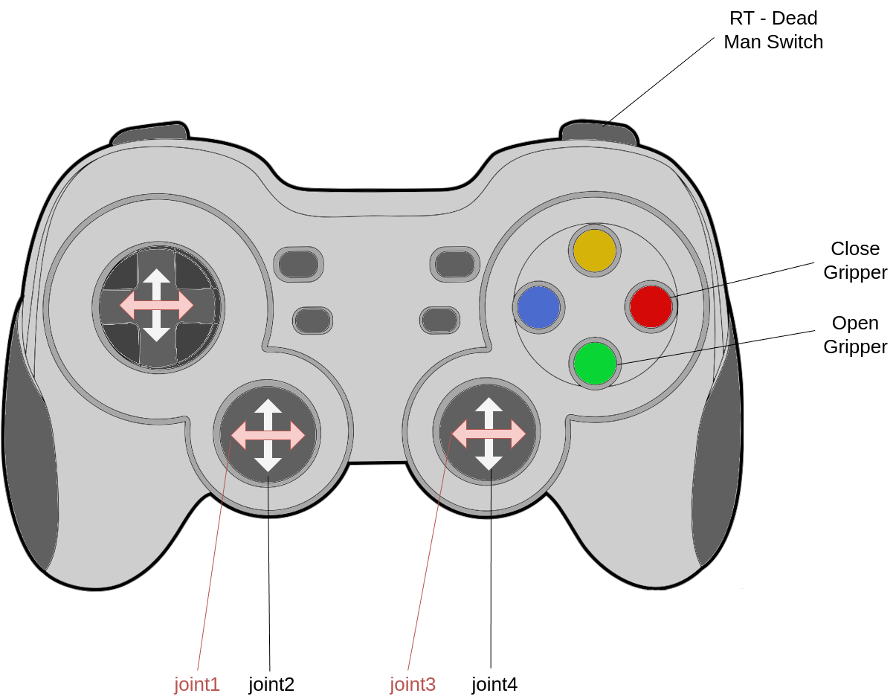
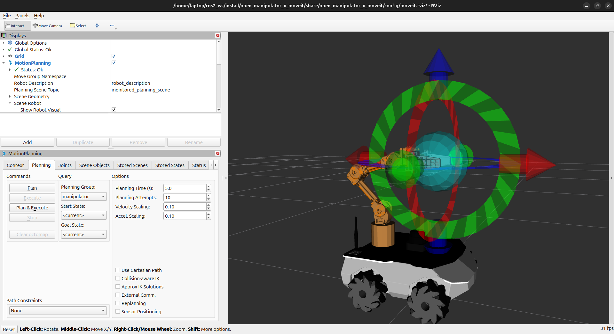

# ROSbot XL Manipulation

Below is a handful of the most important information for the manipulator. Please read them before starting the manipulator.

> [!WARNING]  
> **Limitations**
>
> 1. Before starting the power supply, set the manipulator so that all joints are within the position limits (including the gripper).
> 2. Controlling MoveIt and via the joystick are two independent processes. You should not send commands to both of these services at the same time.
> 3. When the power supply is lost, the robot loses momentum and falls by inertia. Therefore, you should hold the manipulator when the power is cut off, or call the docking node `ros2 run open_manipulator_x_moveit dock`.

## Gamepad

After running the ROSbot XL Manipulation Package, you should be able to control the manipulator. The easiest way to move the manipulator is to connect a gamepad and steer the robot. The graphic below shows how to steer the manipulator using a gamepad.



## RViz Moveit

To move the manipulator using RViz, you need to build the code first. Then run:

```bash
ros2 launch open_manipulator_x_moveit rviz.launch.py
```

After that, RViz with the Moveit configuration will appear.


