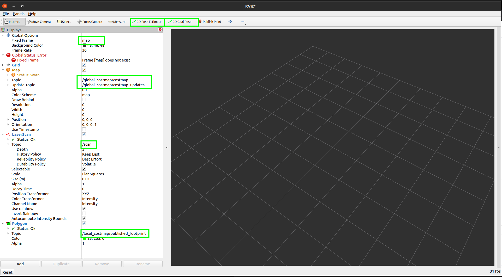

# rosbot_description #

Simulation model for Gazebo integrated with ROS 2.

## Installation. ## 

We assume that you are working on Ubuntu 20.04 and already have installed ROS Foxy. If not, follow the [ROS install guide](https://index.ros.org/doc/ros2/Installation/Foxy/)

Prepare the repository ([more about building packages](https://index.ros.org/doc/ros2/Tutorials/Colcon-Tutorial/)):
```
mkdir ~/ros2_workspace
mkdir ~/ros2_workspace/src
cd ~/ros2_workspace
colcon build --symlink-install
```

Above commands should execute without any warnings or errors.

Clone `ros2` branch of this repository to your workspace :

```
cd ~/ros2_workspace/src
git clone --single-branch --branch ros2 https://github.com/husarion/rosbot_description.git
```

Clone `ros2` branch of forked `rplidar_ros` repository to your workspace :

```
cd ~/ros2_workspace/src
git clone --single-branch --branch ros2 https://github.com/lukaszmitka/rplidar_ros.git
```

Install depencencies:

```
cd ~/ros2_workspace
rosdep install --from-paths src --ignore-src -r -y
```

Build the workspace:

```
cd ~/ros2_workspace
colcon build --symlink-install
```

From this moment you can use rosbot simulations. Please remember that each time, when you open new terminal window, you will need to load system variables:

```
source ~/ros2_workspace/install/setup.sh
```

## How to use ##

This example allows to build a map and navigate to user defined destinations.

To run the simulation:

```
ros2 launch rosbot_description rosbot_sim.launch.py
```

To run on ROSbot 2.0:

```
ros2 launch rosbot_description rosbot.launch.py
```

To run on ROSbot 2.0 PRO:

```
ros2 launch rosbot_description rosbot_pro.launch.py
```

## Navigation with pre build map 

To launch simulation on pre-build map fiew steps are requred 

1. Download world made by amazon 

```
cd ~/husarion_ws/src/
git clone -b ros2 https://github.com/aws-robotics/aws-robomaker-bookstore-world.git 
cd .. && rosdep install -y -r -q --from-paths src --ignore-src --rosdistro foxy
colcon build --symlink-install --cmake-args -DCMAKE_BUILD_TYPE=Release
```

2. Run demo

```
. ~/.bashrc # or . ~/husarion_ws/install/setup.bash
ros2 launch rosbot_description nav_amcl_demo_sim.launch.py 
```

3. Set initial pose of robot

Open other terminal and run rviz ether from our container [rosbot-remote](https://github.com/husarion/rosbot-remote) (all configuration set) or manually run rviz2 and set necessary displays.


```
rviz2
```

*- Set fixed frame to `map`
*- Add `Map` and `LaserScan`
*- Using `2D Pose Estimate` point rosbot somewhere to initialize localization and then set pose again to more-less right place and set goal using `2D Goal Pose`



